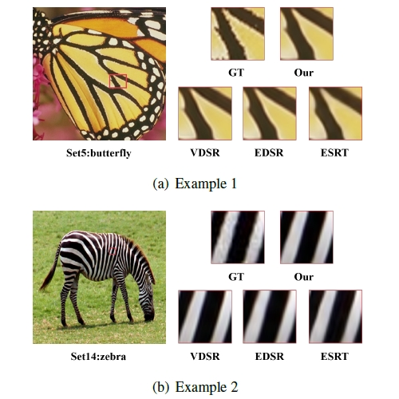
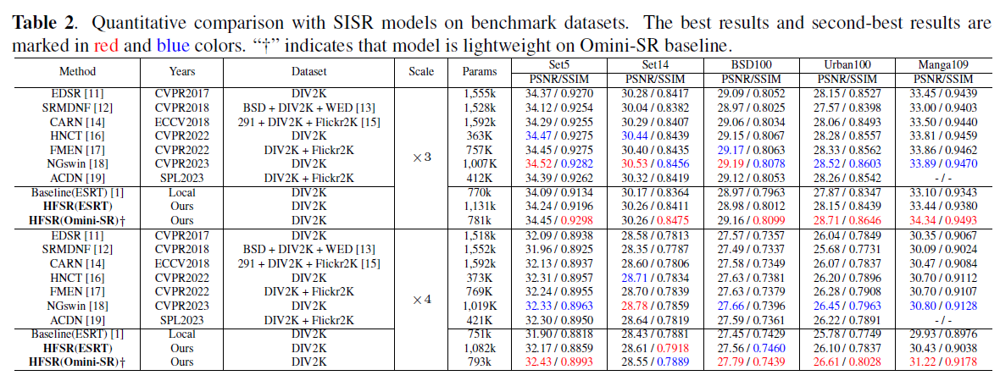

# HIERARCHICAL ATTENTION AND DETAIL ENHANCEMENT FOR SINGLE IMAGE SUPER RESOLUTION (HADEM-SR)
## UnderReview

**The official repository with Pytorch**

## Preparation
- Step 1, Please download [Omni-SR](https://github.com/Francis0625/Omni-SR) first, and build the experimental environment step by step refer to the official repository of the readme.txt.

- Step 2, Download this repo and put them in the folder corresponding to ```./Omni-SR/```:

  **Clone this repo:**
  ```bash
  git clone https://github.com/DL-YHD/HADEM-SR.git
  ```

  Note: We provide our pretrained models, train logs and you can directly use our "env.json" file, where we replace the absolute path with a relative path without modifying the data path.

## Dependencies
- PyTorch>1.10
- OpenCV
- Matplotlib 3.3.4 
- opencv-python 
- pyyaml
- tqdm
- numpy
- torchvision

## Evaluate Pretrained Models
### Example: evaluate the model trained with DIV2K@X4:

- Step 1, the following cmd will report a performance evaluated with python script, and generated images are placed in ```./Omni-SR/SR```
  ```
  python test.py -v "HLFSR_X4_DIV2K" -s 1000 -t tester_Matlab --test_dataset_name "Urban100"
  ```
- Step2, please execute the ```Evaluate_PSNR_SSIM.m``` script in the root directory to obtain the results reported in the paper. Please modify ```Line 8 (Evaluate_PSNR_SSIM.m): methods = {'HLFSR_X4_DIV2K'};``` and ```Line 10 (Evaluate_PSNR_SSIM.m): dataset = {'Urban100'};``` to match the model/dataset name evaluated above.

## Training

  - Step1, Please download the corresponding data according to Step 1 and Step 2 of the Training section in the readme file of the [Omni-SR](https://github.com/Francis0625/Omni-SR).

  - Step2, training with DIV2K $\times 4$ dataset:
    ```
    python train.py -v "HLFSR_X4_DIV2K" -p train --train_yaml "train_HLFSR_X4_DIV2K.yaml"
    ```
    or if you want to fine-tune the network, you can set the parameters -p, -e to specify the phase and checkpoint, respectively.
    ```
    python train.py -v "HLFSR_X4_DIV2K" -p finetune -e 1 -c 0 --train_yaml "train_HLFSR_X4_DIV2K.yaml"
    ```
    Note: parameter "-c" denotes gpu id.

## Visualization

  

## Results
  


## Related Projects

## License
This project is released under the Apache 2.0 license. 

## To cite our paper
If this work helps your research, please cite the following paper:

```

```
